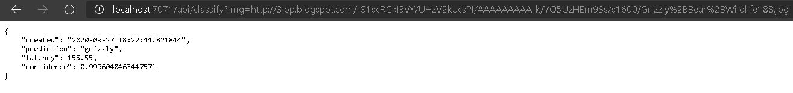
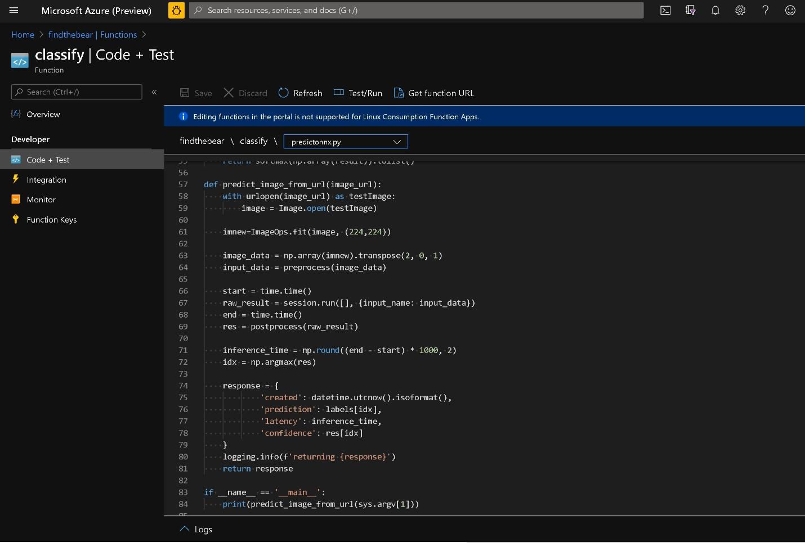

# Model deployment to Azure Functions

This is a quick guide to deploy trained fast.ai models as web services in Azure Functions, a cloud based serverless infrastructure, that allows you to consume these models from applications written in any language using HTTP calls. Azure Functions provides thedevelopment tools to first  build your application either locally or a cloud based desktop and then deploy them to the cloud. 

## Pricing
Azure Functions pricing is found [here](https://azure.microsoft.com/pricing/details/functions/). 

[Free trials](https://azure.microsoft.com/free/) are available. For first 12 months storage accounts upto 5GB is free. Azure Functions is free upto 1M requests/month. A full list of free allowances and free trials can be found [here](https://azure.microsoft.com/free/). 

## Pre-requisites

Before you begin, you must have the following:

1. An Azure account with an active subscription. [Create an account for free](https://azure.microsoft.com/free).

 On a Linux system or Windows (WSL or WSL2) ensure you have the following installed:

2. The [Azure Functions Core Tools](https://docs.microsoft.com/en-us/azure/azure-functions/functions-run-local#v2)
3. The [Azure CLI](https://docs.microsoft.com/en-us/cli/azure/install-azure-cli) 
4. Python 3.7

Note: With an Azure subscription, you can also use [Azure Cloud Shell](https://shell.azure.com/) which comes preinstalled with Azure CLI and Functions Core Tools. 

## Develop and Test Locally

You can develop for serverless deployment on Azure functions on your Linux machine or Windows machine with Windows Subsystem for Linux (WSL) locally or a cloud development VM (like the [Azure Data Science VM](http://aka.ms/dsvm])) on the cloud or [Azure Cloud Shell](https://shell.azure.com/). 

Run the following commands to setup your Azure Functions project on your development machine.

### Create a Function App project and start directory 

```
mkdir << Your projectname >>
cd << Your projectname>>
mkdir start
cd start
```

### Initialize Function App

```
func init --worker-runtime python
func new --name classify --template "HTTP trigger"
```

This creates a Function App that is triggered when it received a HTTP request. 

### Copy the deployment code template

```
git clone https://github.com/Azure-Samples/functions-deploy-pytorch-onnx.git ~/functions-deploy-pytorch-onnx

cp -r ~/functions-deploy-pytorch-onnx/start ..

```
The main files are **[ __ init__.py ](https://github.com/Azure-Samples/functions-deploy-pytorch-onnx/blob/main/start/classify/__init__.py)** and **[predictonnx.py](https://github.com/Azure-Samples/functions-deploy-pytorch-onnx/blob/main/start/classify/predictonnx.py)** in ```start/classify``` directory. The one in the repo works for the Bear detector example in fast.ai. It takes input from the HTTP GET request in "img" parameter which is a URL to an image which will be run through the model for prediction of the type of bear.  You can adapt the same easily for deploying other models.

### Create and activate Python virtualenv with ONNX runtime and dependencies

```
python -m venv .venv
source .venv/bin/activate

pip install --no-cache-dir -r requirements.txt  
```

### Export the model
Export the fast.ai / PyTorch model (learn.model) into [ONNX](http://onnx.ai) format to reduce the memory footprint and enable serving the model efficiently using [ONNXRuntime](https://github.com/microsoft/onnxruntime). At the end of the model training (like the Bear Detector sample) in fast.ai, you will have a ```learn.model```. Here is code to generate the model.onnx file for this fast.ai (or Pytorch) model from the ```learn.model```.

```
dummy_input = torch.randn(1, 3, 224, 224, device='cuda')
onnx_path =  "./model.onnx"
torch.onnx.export(learn.model, dummy_input, onnx_path, verbose=False)
```

Copy your ONNX model file (which should have a name model.onnx)  built from training the Pytorch model into  the "start/classify" directory within your Function App project. 


You also need to create a ```labels.json``` in ```start/classify``` directory. For the fast.ai 3 class Bear detector example it looks like this ```["black","grizzly","teddy"]``` matching the class label and index during training. 

### Run the test locally

```
func start
```
With this command your model has been deployed into a web service hosted as a local instance of Azure Functions. In the output you will see the port on which the web service is listening. It is usually port 7071. 

In a browser on your machine you can test the local Azure Function by visiting: 

"http://localhost:7071/api/classify?img=http://3.bp.blogspot.com/-S1scRCkI3vY/UHzV2kucsPI/AAAAAAAAA-k/YQ5UzHEm9Ss/s1600/Grizzly%2BBear%2BWildlife188.jpg"

You should see the prediction from the model outout as a JSON. 



Now that you have verified the model deployment and consumption locally, you are ready to deploy it to the cloud. 

## Deploy to the Cloud

In order to deploy the model to the cloud, you must create the neccesary resources like a storage account and a Function App. We will use Azure Command Line Interface (CLI) to do this. 

### Create Azure resources using Azure CLI

```
az group create --name [[YOUR Function App name]]  --location westus2

az storage account create --name [[Your Storage Account Name]] -l westus2 --sku Standard_LRS -g [[YOUR Function App name]]

az functionapp create --name [[YOUR Function App name]] -g [[YOUR Function App name]] --consumption-plan-location westus2 --storage-account [[Your Storage Account Name]] --runtime python --runtime-version 3.7 --functions-version 3 --disable-app-insights --os-type Linux
```

### Notes

* If you have not logged into Azure CLI. you must first run “az login” and follow instructions to log into to Azure with your credentials. 
* In the example above, we are deploying the resources in westus2. You can choose another Azure data center/ region if that is more convenient for you. 
* Azure Functions supports different [hosting plans](https://docs.microsoft.com/azure/azure-functions/functions-scale) from basic instances with a consumption plan, to premium instances and dedicated hosting. We use the “consumption plan” above which is usually the most cost effective (often free upto 1 million monthly requests per subscription ) option for relatively low volume scenarios.
*  Above, we set a flag to disable [Application Insights](https://docs.microsoft.com/azure/azure-monitor/app/app-insights-overview) on this Azure Functions App. Application Insights is a service Azure provides to help you monitor your Azure Functions and other Azure services. We recommend enabling Application Insights for production deployment and refer you to the documentation on [Functions Monitoring](https://docs.microsoft.com/azure/azure-functions/functions-monitoring) for more information on its usage.


### Publish to Azure

```
pip install  --target="./.python_packages/lib/site-packages"  -r requirements.txt

func azure functionapp publish [[YOUR Function App name] --no-build


```

It will take a few minutes to publish and bring up the Azure functions with your ONNX model deployed and exposed as a http endpoint.  Then you can find the URL by running the following command:  ```func azure functionapp list-functions [[YOUR Function App name] --show-keys``` . 

Append ```&img=[[Your Image URL to run thru model]]``` to the URL on a browser to get predictions from the model running in the Azure Functions. 

Now, your model predictions can be consumed by your applications written in any language as you just need to make a HTTP request. 

You can manage the deployed serverless function on Azure Portal. 



There is an accompanying [blog post](https://medium.com/pytorch/efficient-serverless-deployment-of-pytorch-models-on-azure-dc9c2b6bfee7) with some additional details on this approach to deploy models in ONNX format to Azure Functions. 