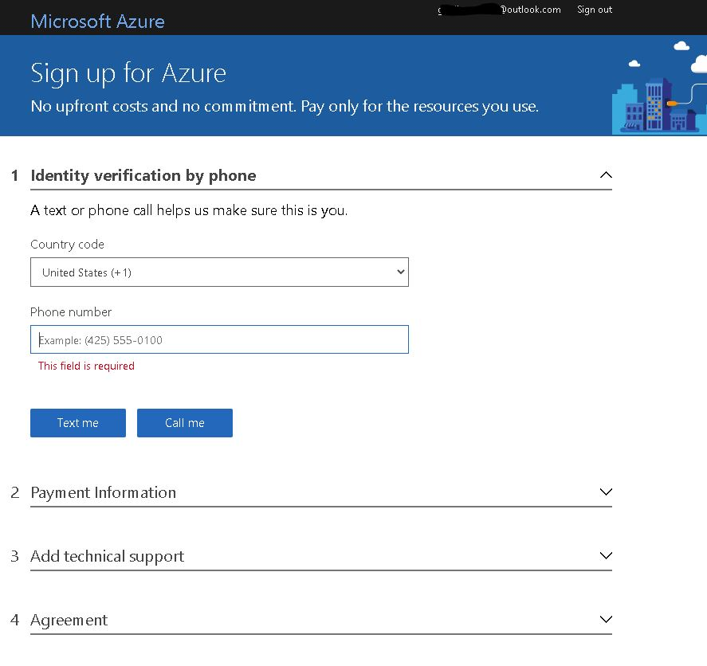
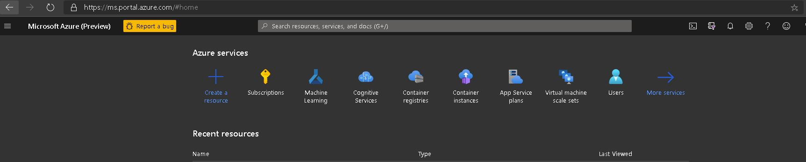
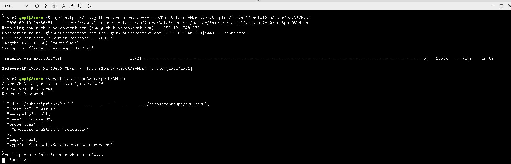
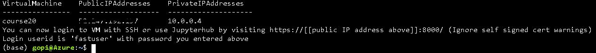
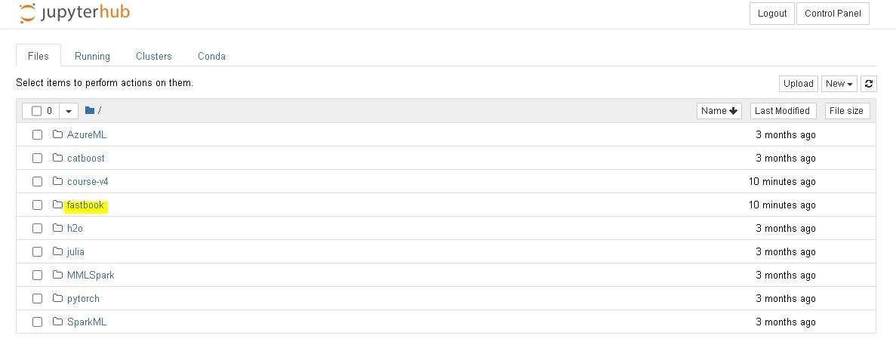
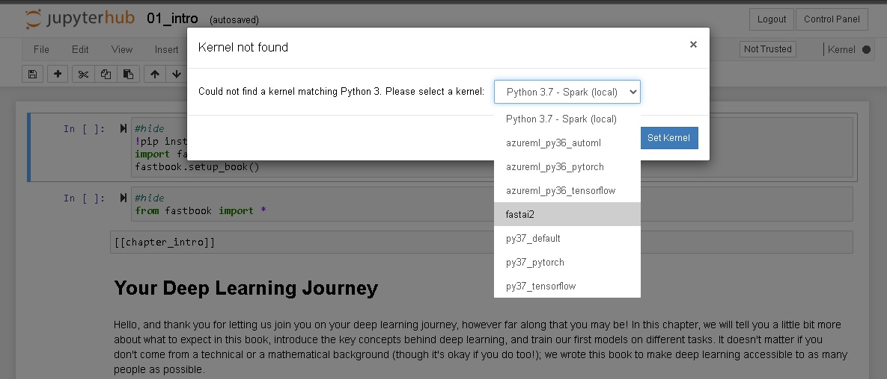

# Azure Data Science Virtual Machine

This is a quick guide to getting started with fast.ai Deep Learning for Coders course on [Microsoft Azure](https://azure.microsoft.com/) cloud. We will use the Azure [Data Science Virtual Machine (DSVM)](http://aka.ms/dsvm) which is a family of Azure Virtual Machine images, pre-configured with several popular tools that are commonly used for data analytics, machine learning and AI development. 

## Pricing
The cheapest GPU configuration is a Standard_NC6 instance in Azure which has one NVidia Tesla K80 GPU and six CPU cores. This instance will incur about $0.40 per hour of [compute charges](https://azure.microsoft.com/en-us/pricing/details/virtual-machines/linux/) for a dedicated Standard_NC6_Promo instance, or **$0.13** per hour if you use [Spot (pre-emptable) Standard_NC6 instances](https://azure.microsoft.com/en-us/pricing/details/virtual-machine-scale-sets/linux/). 

Azure provides other [GPU options](https://docs.microsoft.com/azure/virtual-machines/sizes-gpu) like the NVidia Tesla P100, V100 based instances.  

## Pre-requisites
Before you can create a DSVM, you need access to an Azure subscription. An Azure subscription allows you to manage storage, compute, and other assets in the Azure cloud. You can [create a new subscription](https://azure.microsoft.com/en-us/pricing/purchase-options/pay-as-you-go/) or access existing subscription information from the [Azure portal](https://portal.azure.com/).

If you are signing up for a new subscription you will also need to have credit card details on file. This will be the credit card to which all the charges of the instance usage will be applied. Your sign up screen will look like:



[Free trials Azure subscriptions](https://azure.microsoft.com/free) are also available though you will not be able to create a GPU based virtual machine instances.

After your Azure account and subscription is created, you can login to the [Azure portal](https://portal.azure.com/) to view and manage your account.



## Setup
We will use convenience scripts leveraging Azure Command Line Interface (CLI) to create a Spot instance of a Data Science VM and automatically install fast.ai library and the course notebooks during the creation of the VM. 

### Step 1: Launch Cloud Shell
The scripts to setup fast.ai can be run on a bash shell on a Linux machine or a Windows machine with Windows Subsystem for Linux (WSL). It may be simpler to launch an Azure Cloud shell. You do that by simply clicking the button below. 

[](https://shell.azure.com)

Follow the prompt to create a storage account that stores your script. In a few seconds you will have the familiar bash shell prompt where you can run shell scripts. Ensure your Azure shell is set to "Bash" and not "PowerShell" in the option in thetop  left corner of the Azure Shell.  

### Step 2: Execute the scripts
The scripts to automatically create an Azure Data Science VM and install the fast.ai along with all the course lesson notebooks are provided on [Github](https://github.com/Azure/DataScienceVM/blob/master/Samples/fastai2/fastai2onAzureSpotDSVM.sh). 

The script creates a Spot VM with NVidia K80 GPU in the westus2 Azure region. You can customize the script if you want a different type of GPU or want a dedicated (non-preemptable) instance instead of a Spot(preemptable) instance or want to choose a different Azure datacenter region. 

To download and execute the script, run the following command on the Azure Cloud Shell you started or the bash shell if you are using a local machine. 

```
wget https://raw.githubusercontent.com/Azure/DataScienceVM/master/Samples/fastai2/fastai2onAzureSpotDSVM.sh
bash fastai2onAzureSpotDSVM.sh
```

Follow the prompt where it will ask for a VM name and password. The script uses "fastuser" as the username.  

TIP: Press SHIFT-INSERT in Cloud Shell to paste the command and execute it.



Within about 10 minutes you will have a VM ready to start running your fast.ai course notebooks. The script will print out the IP address of the VM and the URL to use to access Jupyterhub. 



### Access fast.ai course notebooks
Now you can access the VM either through SSH or via Jupyterhub (URL : https://[[Public IP Address of VM]]:8000). When you login to JupyterHub use the default user name used in the script ```fastuser``` and the password you chose above. 

NOTE: Since by default self-signed certificates are used, you will get a warning when trying to access JupyterHub through SSL that you can ignore for this purpose by pressing the 'Advanced" button and then "Continue" on your browser. In a production setting you will need to get real certificates and install them. 

Once you are logged into Jupyterhub, you will find the fastbook directory, which contains the  lesson notebooks for the fast.ai course. 



You will get a prompt to choose the matching kernel. There is a Jupyter kernel and Conda environment named ```fastai2``` that you will need to use when running the fast.ai notebooks. 



## Stopping the VM
In order to avoid incuring charges when not using the VM, you must shut it down. You can do so on the Azure Portal or running the Azure CLI command 

```az vm deallocate -g <resource group name > -n <vm name>```

By default in our script the "resource group name" is the "vm name". 

Once you are done with course you can delete the resources by deleting the resource group in the Azure Portal or with the CLI command. 

```az group delete -n <resource group name>```

