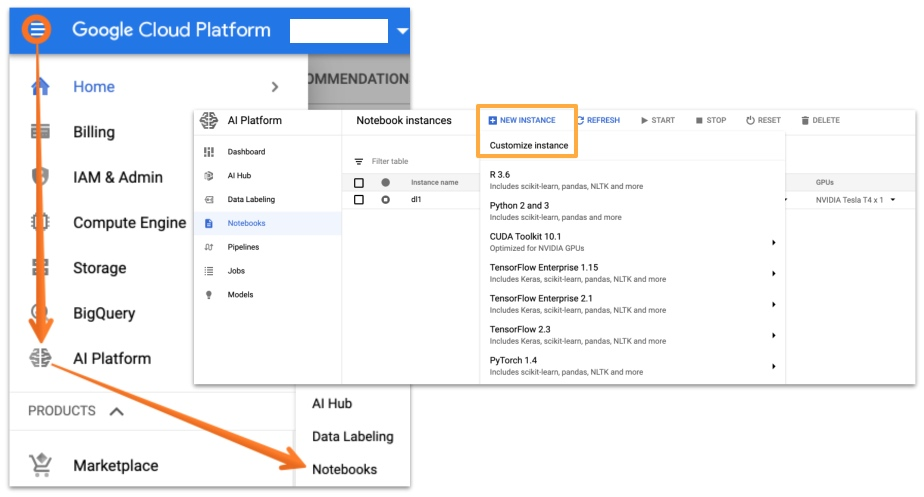
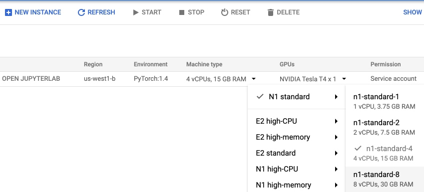
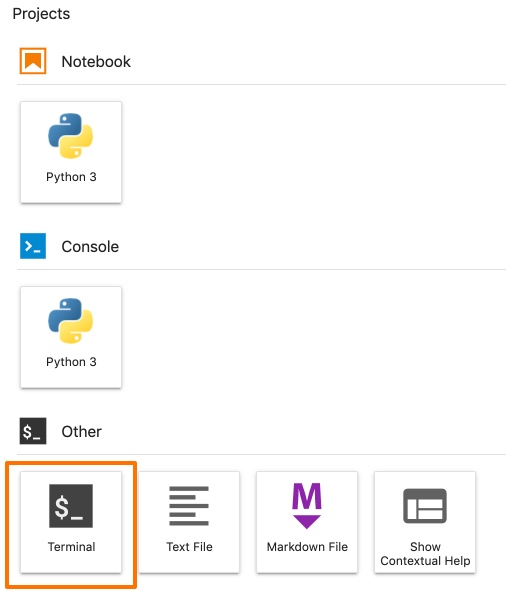

# Google Cloud Platform


This is a quick guide to getting started with Deep Learning for Coders on [Google Cloud](https://cloud.google.com/). Although this is not the cheapest option it gives you:
- configuration flexibility (update GPU/CPU/Memory in seconds)
- possibility to easily run multiple notebook instances at the same time (simple GUI)
- access to other Google services (BigQuery, Google Storage, Data Labeling, deployment with Google Engine and more)
- every new user gets [**300$ credit**](https://cloud.google.com/free?hl=ar)

The basic setup for the course is straightforward and does not require complicated configuration.

## Pricing

The pricing may vary a lot depending on the region (`us-west1-b` below) and your machine specification:

- 4 vCPUs, 15 GB RAM, NVIDIA Tesla T4 - $0.382 hourly
- 8 vCPUs, 30 GB RAM, NVIDIA Tesla T4 - $0.515 hourly
- 4 vCPUs, 15 GB RAM, NVIDIA Tesla P100 - $1.159 hourly
- 8 vCPUs, 30 GB RAM, NVIDIA Tesla P100 - $1.292 hourly

Prices include 100GB Standard Persistent Disk.


## Step 1: Create an account

In case you don't have a GCP account yet, you can create one [here](https://cloud.google.com/). It comes with $300 worth of usage credits for free.

>  **Potential roadblock**: Even though GCP provides a $300 initial credit, you must enable [billing](https://console.cloud.google.com/billing/) to use it. You can put a credit card or a bank account but the latter will take several days for the activation. 

The project on which you are going to run the image needs to be linked with your billing account. For this navigate to the [billing dashboard](https://console.cloud.google.com/billing/projects), click the '**...**' menu and choose '**change billing account**'.

## Step 2: Request GPU quota increase

By default your quota for "GPUs (all regions)" is set to 0, and you will need to request a quota increase in order to create a Notebooks instance with a GPU (as described below). Follow [these instructions](https://cloud.google.com/ai-platform/training/docs/quotas#requesting_a_quota_increase) to increase the quota for "GPUs (all regions)" to at least 1. Google says that the quota increase request may take up to 48 hours to process, but usually it should be processed much faster.

## Step 3: Create Notebook

1. From the menu on the left hand side choose "AI Platform" -> "Notebooks"
2. Click "New Instance" ("Customize instance" to choose your options. Make sure you've completed step 2 above if you want to select a GPU. You get price calculation on the right.)
3. You should see the instance listed. Select a checkbox and click "START"
4. After ~2mins click "OPEN JUPYTERLAB"




You can start/stop your instance as well as adjust GPU/CPU/Memory from the GUI:




## Step 4: Install libraries

Before you start working you will need to update the fastai library and lesson notebooks. Jupyter Lab is just a jupyter notebook with some extra features to organize multiple notebooks and other files (read more [here](https://jupyter.org/)). It comes with the terminal so you can just run all your additional installs from here:



To install the recent version of fastai and download the course run:

```
conda install -c fastai -c pytorch fastai
git clone https://github.com/fastai/fastbook.git
pip install -Uqq fastbook
```

>  **CUDA update**: At the moment the instances on GCP come with preinstalled CUDA 10.1 drivers. We need to update it to 10.2. To update CUDA drivers run these two additional lines in the terminal:
```
wget http://developer.download.nvidia.com/compute/cuda/10.2/Prod/local_installers/cuda_10.2.89_440.33.01_linux.run
sudo sh cuda_10.2.89_440.33.01_linux.run
```


## Step 5: Usage

**Remember to stop your instances!** (You can download Google Console app on your phone to stop them when you are not at your desk.)
