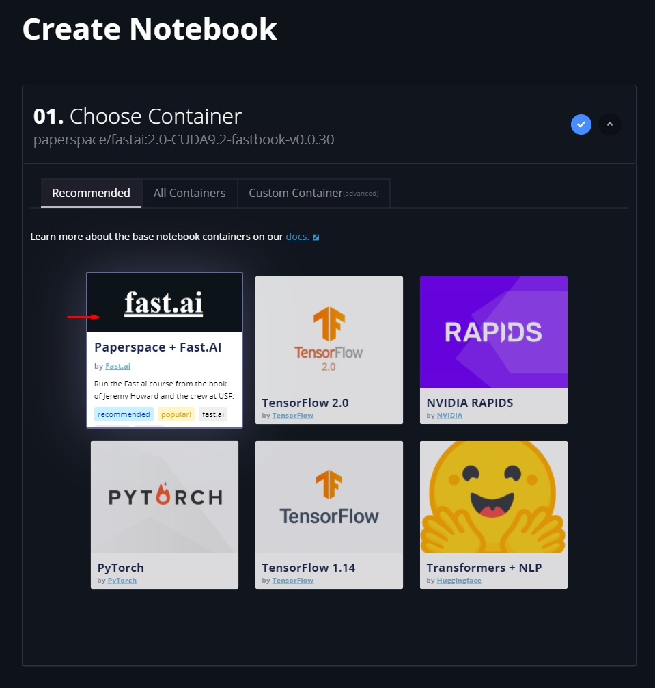
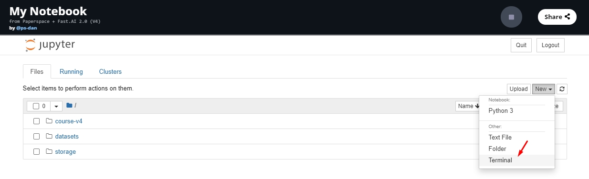
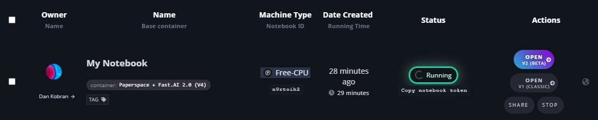
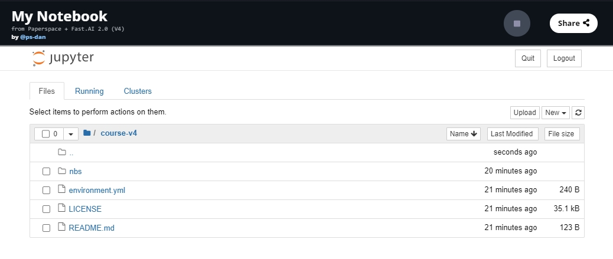
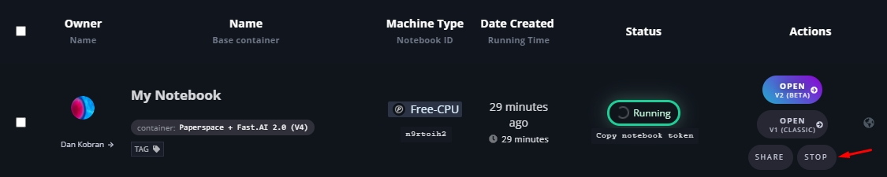

# Paperspace Gradient

This is a quick guide to getting started with Deep Learning for Coders on Paperspace Gradient. With [Gradient](https://gradient.paperspace.com/), you get access to a Jupyter Notebook instance backed by a free GPU in less than 60 seconds, without any complicated installs or configuration. [Gradient](https://gradient.paperspace.com/) is built on top of [Paperspace](https://www.paperspace.com/), a GPU-accelerated cloud platform.

## Pricing

**Paperspace recently introduced a [Free Tier of free GPU and CPU instances](https://docs.paperspace.com/gradient/instances/free-instances).** To use them, choose *Free-GPU* or *Free-P5000* (recommended) in step 2.6 Create Notebook.

Note: Additional capacity and more powerful GPUs are available with paid instance types.  Use the Fast.ai promo code (see below) for free credit 💰 when using these instances.  Paid instances are billed while they're running (per second!) and the rate is dependent on the [Instance Type](https://gradient.paperspace.com/instances) selected. Notebooks must be stopped to end billing.  Consider using new [Gradient "preemptible" instances](https://docs.paperspace.com/gradient/instances/preemptible-instances) which can save you money when using paid instances.

## Step 1: Create an account

To get started, create an account [here](https://console.paperspace.com/signup?gradient=true) and confirm your account by clicking the verification link in your inbox.

## Step 2: Create Notebook

1. Login and select Gradient > Notebooks.

2. Select the _Paperspace + Fast.AI_ base container.

1. Select the type of machine you want to run on.

Important note: remember that you can change the instance type _at any time._ This means you can start out running on an inexpensive or free instance, and then, whenever you want, switch to a much more powerful instance to execute code as efficiently as possible. Instance type is independent of your notebook. When you return to work, the instance type should self-select to whatever type you last used. But it's a good idea always to check! This will prevent billing and performance surprises.

1. Name your Notebook (optional)

2. Enter your payment details (if using a paid instance type). _Even if you have a promo or referral code, all paid instances require a valid credit card on file._

3. Click Create Notebook

Your Notebook will go from Pending to Running, and will be ready to use 🌟.

Note: When you are using paid instances, clicking Create Notebook will start your Notebook and your billing session will begin. To stop billing, you must stop your Notebook.

## Step 3 : Update the fastai library

Before you start working you will need to update the fastai library and lesson notebooks. To do this you will have to access the terminal. You can do this by clicking in 'New', 'Terminal'.

Once you click on 'Terminal' a new window should open with a terminal. Type:

    pip install fastai fastcore --upgrade

then

    cd fastbook
    git pull

Now you should close the terminal window.

## Step 4: Start learning Fast.ai!

You should now have a running fast.ai notebook. It might take a few seconds to provision, but once it's running you just have to click "Open" to access your Jupyter notebook.

Next from your jupyter notebook, click on 'fastbook' and you should look at something like this:

Go back to the [first page](https://course.fast.ai/index.html) to see how to use this jupyter notebook and run the jupyter notebook tutorial. Come back here once you're finished and _don't forget to stop your instance_ with the next step

## Step 5: Stopping your Notebook

Just click stop on the notebook page or notebook list view. This will end the session.

NOTE: When using paid instances, you _will_ be charged for the time that your notebook is running. You must stop the notebook to stop incurring charges.

* * *

## Additional considerations:

### Managing Data

The `/storage` folder is your [Persistent Storage](https://docs.paperspace.com/gradient/data/storage#persistent-storage). Files placed here are available across all Notebooks, Jobs, and Linux VMs (currently free of charge). This repository is perfect for storing datasets, models etc. Note: Persistent Storage is region specific (you'll see the storage region options when creating Notebooks and Jobs).

### Sharing your notebook

Gradient Notebooks can be shared publicly so others can view and/or fork your work.  Just click the "share" button to generate a unique URL.

### Viewing a stopped notebook

Gradient Notebooks can be viewed without running them. Just click open to view a static version of the notebook.

### Promotional credit

Paperspace provides $15 of free Gradient credit for using paid instances. This code is to be used for Fast.ai students only. In your console, click on Billing and enter the promo code at the bottom right. The promo code for this course is: **FASTAIGR20**. _Note: the code is valid until Dec 31st, 2020_

### Where to get help

Questions or issues related to course content, we recommend posting in the [fast.ai forum](http://forums.fast.ai/). For Paperspace-specific support, check out the rest of the [Gradient Docs](https://docs.paperspace.com/gradient/) or submit a support ticket with [this form](https://support.paperspace.com/hc/en-us/requests/new).

## Developing fastai on Gradient

If you would like to follow the [Developer guide for fastai](http://docs.fast.ai/dev-setup) and help develop the fastai library from your Gradient instance,
read this section first for some Gradient-specific recommendations.

> The Gradient terminal is easier to use if you first type `bash` after opening the terminal window. This will let you use the up/down arrows to explore command history, as well as use tab for text completion. To paste text into the prompt, use `ctrl-shift-v` in the terminal window. 

### Things to keep in mind before working through the section [Setting up access and `gh`](http://docs.fast.ai/dev-setup#Setting-up-access-and-gh):

Start with the _Paperspace + Fast.AI_ base container instance that you've already created.

Your gradient instance has miniconda, not anaconda, so follow the miniconda-specific instructions in the developer guide. For example, the first command of the developer guide should be `conda install -y -c fastai -c pytorch fastai gh nbdev`

If you are working through the Github SSH keygen tutorials and the `ssh-keygen` command doesn't work, you first need to install openssh-client on your Gradient instance. Type the commands 

    apt-get update
    apt-get upgrade
    apt-get install openssh-client

and then continue with the GitHub tutorial.

### Things to keep in mind before working through the section [Set up `fastcore`](http://docs.fast.ai/dev-setup#Set-up-fastcore):

Run these `clone` commands from the `/notebooks` directory, so the repos end up here next to the other ones.
