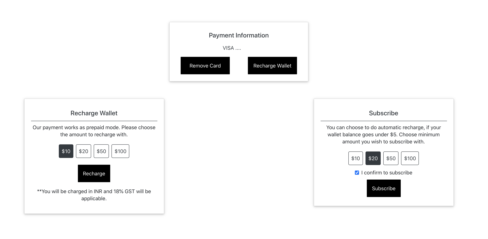

# JarvisCloud


JarvisCloud was built primarily with 2 purposes in mind. We want the platform to be simple and affordable for deep learning and AI practitioners. 

By the end of the post, you would be able to create a Jupyter notebook and also ssh into the instance.  All in less than 30 seconds. 

## Pricing

We currently offer 2 kinds of GPUs. RTX 5000 (16GB) is priced at 0.49$ an hour and RTX 6000 (24GB) at 0.99$ an hour. We recommend using RTX 5000 for this course. All fastai users get a discount of 20% on RTX 5000 GPU's. So RTX 5000 cards will cost you $0.392 per hour which is the lowest to our knowledge and each instance comes with a free 20GB of storage space. 

While not using the instances, you can pause the instances and you will only be charged $0.0005 per GB for every hour. So the 20GB storage will cost you $0.01 per hour. 

All the instances are charged at the start of the hour. 

## Step 1: Create an account
Sign up using this [link](https://cloud.jarvislabs.ai/?token=fastaiv4) to get the 20% discount on RTX 5000. 

## Step 2: Add Credits
To avoid any unnecessary billings we follow a prepaid system. You buy credits using a credit card. For all the activities like create, pause and resume we deduct money from the credits added to the Jarviscloud wallet. 

### Add a Credit card 
We use Stripe for managing all the credit card transactions. All the data shared with us related to your card is passed directly to Stripe. We do not store any information. You can add card details from the accounts section.


### Recharge the wallet
Once the card is added successfully, you can recharge for a predefined amount of $10, $20, $50, or $100. If the recharge is successful, then we add the same amount as credits in your wallet.


### Subscribe for automatic recharges
You can also automate recharging the wallet when the balance goes less than $5 by subscribing to a range of amounts like $10, $20, $50, or $100. This is completely optional. 

You can enable the subscribe by checking on to "I confirm to subscribe" and pressing the subscribe button. 




## Step 3: Launch Instance to learn Fast.ai

Choose the framework of choice, number of GPU's, type of GPU and storage you need. All the instances come with 20 GB storage by default. If you are starting with fast.ai then 20 GB should be enough. 


Once you have chosen the configuration press the launch button. Your instance will be created in less than 30 seconds. You should be able to see a running instance like this. 


Commonly used tools like git, wget and several other python libraries come preinstalled along with the chosen framework. 
**Launch only when you are ready to use, as the instances are charged for an hour**. 

There are 4 important things that you can quickly do from the running instances. You can access jupyter lab, pause the instance after using, remove it completely when done, and also connect to the instance through the command line(Optional). 

### Connect to Jupyter Lab & start learning fast.ai
Clicking the green color play button on the running instance opens a Jupyter Lab. If you like to work with Jupyter notebook, then change the word **lab** to **tree** in the url. 


You can see the **fastbook** folder already downloaded for you. Open a terminal and navigate to the **fastbook** folder and do a git pull to update the course.

```
cd fastbook/
git pull
```

###  Pause your instance
After running few experiments, if you want to pause the instance for later use then press the blue color pause button. You will be charged only for the storage during the paused duration.

All the paused instances are listed below the running instances.


### Resuming an instance
You can hit the play button on the paused instance to resume your work. A new instance is created with all your previous data. 

### Destroying/Stopping the instance
If you have completed your work and no longer require the instance, then press the red color trash button, which will delete/destroy the entire instance. This is not a recoverable event, so ensure you have backed up any data that is required. 

**Note: Ensure you either pause or destroy the instance to avoid any unnecessary billings**

### Connecting via SSH to the instance
You can also see a ssh command, which lets you ssh to the instance from a command line tool. If you like using VS code for coding, then you can use this to connect the VS Code to the remote instance. For simple access to the command line, you can use the terminal from jupyter lab. 

**To see the ssh command you need to update your public ssh key from the API keys section**

## Step 4: Add SSH keys
If you have created your ssh_keys earlier you can access it by using the below command in a **local**  terminal / PowerShell and update it in the API keys section.
```
cat ~/.ssh/id_rsa.pub
```


If you do not have a ssh key then quickly create one. 

### Create your local SSH key pair

Run the following command in a  **local**  terminal / PowerShell to generate an SSH key pair:
```
ssh-keygen -t rsa -b 4096
```

## Need help

Questions or issues related to course content, we recommend posting in the [fast.ai forum](http://forums.fast.ai/).

Anything related to JarvisCloud, drop an email to hello@jarvislabs.ai. 
