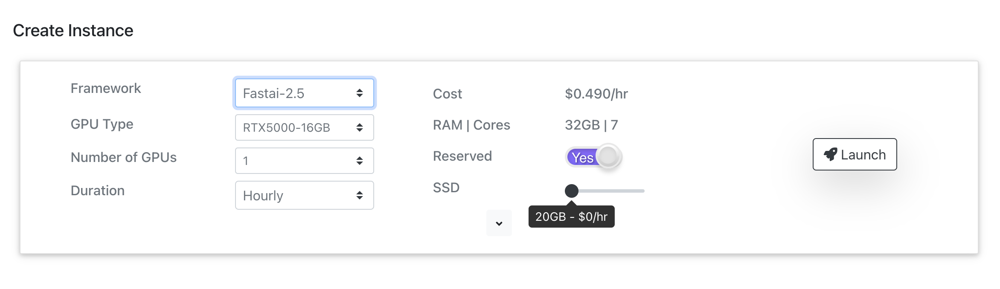

# Jarvislabs.ai


This is a quick guide to starting Practical Deep Learning for Coders using [Jarvislabs.ai](https://jarvislabs.ai/). With Jarvislabs.ai you get a GPU powered Jupyter notebook pre-configured with all the necessary software in less than 30 seconds.

## Quick Start

1. Create an account at [cloud.jarvislabs.ai](https://cloud.jarvislabs.ai/register?token=fastaiv4)
1. Add payment information on [billing section](https://cloud.jarvislabs.ai/account)
1. Recharge your wallet [here](https://cloud.jarvislabs.ai/account)
1. Select machine type [here](https://cloud.jarvislabs.ai/), framework, and click `Launch`
1. Start, Pause, or Delete with the buttons 

> Note: Paused instances are charged only for storage.

## Pricing

### Running instance

[Jarvislabs.ai](https://cloud.jarvislabs.ai/?token=fastaiv4) offers below GPU-powered instances.

| GPU      | GPU RAM | vCPUS | RAM  | Reserved | Spot     |
| -------- | ------- | ----- | ---- | -------- | -------- |
| A100     | 40GB    | 7     | 32GB | $2.39/hr | $0.99/hr |
| A6000    | 48GB    | 7     | 32GB | $1.79/hr | $0.79/hr |
| A5000    | 24GB    | 7     | 32GB | $1.29/hr | $0.59/hr |
| RTX 6000 | 24GB    | 7     | 32GB | $0.99/hr | $0.39/hr |
| RTX 5000 | 16GB    | 7     | 32GB | $0.49/hr | $0.19/hr |

Jarvislabs.ai recommends RTX 5000 to get started.

All fastai students get a discount of 20% on RTX 5000 GPUs. For RTX5000,

- Reserved instance costs $0.392/hr
- Spot instance costs $0.19/hr

Spot instances let you use spare GPU capacity. When the demand increases, your instance may get paused, and any data saved on disk will persist. Spot instances are ideal for

- Learning or exploring
- Code having checkpoints, that allows training from the checkpoint

Each instance comes with 20GB storage and additional storage will be charged at $0.00014/GB per hour for running instances.

> Note: Jarvislabs.ai follows a minute billing.

### Paused instance

To resume your work at a later point in time, Jarvislabs.ai offers a pause feature. During the paused duration you will be charged only for the storage allocated to you. For example, an instance with 20GB storage while paused is charged at $0.0028/hr. You can delete the instance, to stop the billing.

Data gets deleted when you delete the instance or when the account does not have sufficient funds.

## Create an account

Sign up here at [cloud.jarvislabs.ai](https://cloud.jarvislabs.ai/?token=fastaiv4) to get 20% discount on RTX 5000.

## Add Credits

Jarvislabs.ai follows a prepaid system to avoid any unnecessary billing. You can recharge your wallet using a credit/debit card.
For running and paused instances, credits will be deducted from your Jarvislabs.ai wallet.

### Add a Credit card

Jarvislabs.ai uses Stripe to manage all the credit card transactions. All the data shared to Jarvislabs.ai related to your card is passed directly to Stripe. Jarvislabs.ai does not store any information related to your credit card. You can add your card details in the [billing](https://cloud.jarvislabs.ai/account) section.


### Recharge the wallet

Once the card is added, you can recharge for an amount of <span>$</span>10 to <span>$</span>1000. Once the recharge is successful, Jarvislabs.ai will add the same amount as credits in your wallet.


## Launch Instance to learn Fast.ai

Under the create instance section, choose

- Framework : Fast.ai
- Reserved : Yes / No

You can leave the rest of the options if you are just getting started. Click on the Launch button to create the instance.

> Info: Reserved instances keep running till YOU decide to pause/delete them. Choosing a spot instance by selecting NO for Reserved option,
> lets you use a spare GPU at a discounted price. When the demand increases spot instances may get automatically paused.



The instance will be ready in less than 30 seconds. You should be able to see a running instance like this.


Commonly used tools like git, wget, and several other python libraries along with fast.ai course materials come preloaded.

From a running instance, you can perform the below actions.

1. ▶️ Open Jupyter lab
2. ⏸️ Pause instance
3. 🗑️ Delete instance
4. Connect via SSH (Optional)

### Connect to Jupyter Lab & start learning Fast.ai

Click on the ▶️ button on the running instance to open Jupyter Lab.


**fastbook** folder is preloaded in the instance. Open a terminal and navigate to the **fastbook** folder and do a git pull to update the course.

```
cd fastbook/
git pull
```

## Pause your instance

After running experiments, you can pause the instance for later use by clicking the ⏸️ pause button. Instances will be charged only for the storage for the paused duration.

All the paused instances are listed below the running instances section.


> Note: If you are not planning to use the instance further, delete 🗑️ the instance to avoid storage costs.

## Resume an instance

You can hit the ▶️ button on the paused instance to resume your work. A new instance is created with all your previous data.

You can also click on setting ⚙️ to modify the configuration while resuming an instance.

- GPU Type
- Number of GPUs
- Increase/ Decrease storage capacity
- Change instance type from Reserved to Spot or vice-versa


## Delete the instance

When you no longer need the instance, press the red trash 🗑️ button, which will delete the entire instance. Billing for the instance will be stopped. This is not a recoverable event, so ensure you have backed up any data that is required.

**Note: Ensure you delete the instance to avoid any unnecessary billings.**

## Explore further

You can do a lot more with Jarvislabs.ai. Please feel free to explore the [docs](https://jarvislabs.ai/docs/intro/) for further information.

Please reach out to Jarvislabs.ai for any assistance or feature requests through

- Chat option available on Jarvislabs.ai
- Drop an email to hello@jarvislabs.ai