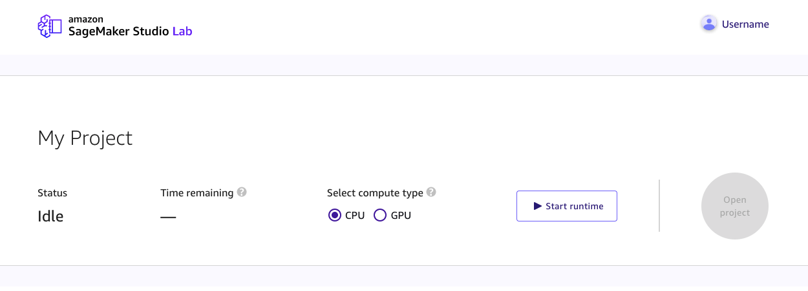
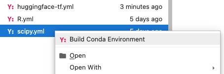

# SageMaker Studio Lab

This is a quick guide to getting started with Deep Learning for Coders on SageMaker Studio Lab. This is a completely free option and you only need a email address to get a SageMaker Studio Lab account. Studio Lab is based on open-source JupyterLab and gives you free access to AWS compute resources to quickly start learning and experimenting with ML.  You can choose between CPU or GPU compute. SageMaker Studio features include 

- A choice between 12 hours of CPU or 4 GPU compute
- At least 15 GB of persistent storage
- Unlimited number of user sessions 

## Step 1 - Request an account

To get started head over to the [SageMaker Studio Lab](https://studiolab.sagemaker.aws/) page and click and click on request a account. All you need is a valid email address to request an account. SageMaker Studio Lab is currently in public preview and it should take a couple of hours to get your approval. Once you get the approval email, confirm and complete your account setup steps.

## Step 2 -  Choose your compute

Once your are logged in, you can choose your desired compute. Currently Studio lab offers 12 hours of free CPU and 4 hours of free GPU compute. After your runtime is active, click on the open project button to open the SageMaker Studio Lab IDE.

## Step 3 - Build your Fastai environment

Before using the fastai course examples , we will need build the environment.  First, head over to the [Studio Lab examples GitHub repository](https://github.com/aws/studio-lab-examples/tree/main/custom-environments/fastai) and download the fastai Conda environment file. Once you have the file on your local studio lan filesystem, there are a couple of ways of creating new Conda environments.

- You can open the Terminal and directly create a new environment using the Conda command line. You can run the below command in a new terminal window

    `$ conda env create --name fastai.yml`
- Alternatively, if you have a Conda environment file, can right click on the file in the JupyterLab file browser, and select the "Build Conda Environment" item as below

Once you have exhausted your compute time, 12 hrs CPU or 4 hrs GPU. You will need to log out and log back in to restart your session. If you are running long training jobs, we recommend you save checkpoints to the local persistent storage.

